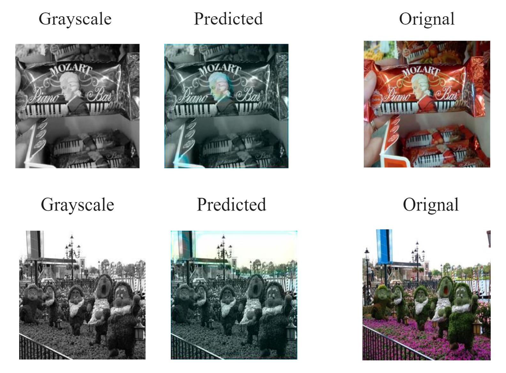

# Image-Colorization_Group8
The goal of this project is to use convolutional neural networks to colorize grayscale images. 

# Introduction
Problem Statement:

Microscopy images play a crucial role in understanding the complex processes occurring in biochemical engineering. The grayscale nature of these images limits our ability to visually observe and interpret the various components and phenomena within them. Therefore, there is a need to develop an image colorization system utilizing neural networks to enhance our understanding of microscopy images and enable a comprehensive visual analysis of the biochemical engineering processes.
The objective of this project was to design and implement a robust neural network-based image colorization model that can accurately add color information to grayscale microscopy images. By leveraging the power of deep learning techniques, the proposed solution aims to enable researchers and engineers to perceive and interpret the finer details, structures, and dynamics of biochemical engineering processes more effectively. This enhanced visual understanding will facilitate the identification of important features, patterns, and abnormalities, leading to better analysis, interpretation, and decision-making in the field.

Dataset Analysis:

Dataset analysis played a crucial role in the development of an effective image colorization system for microscopy images in biochemical engineering. A thorough understanding of the dataset characteristics was essential to make informed decisions during the model development and evaluation phases. 
The dataset needed to be sufficiently large to capture the wide range of variations and complexities present in microscopy images. It should consist of a diverse collection of grayscale microscopy images along with their corresponding ground truth color images. A larger dataset allows the model to learn more comprehensive representations and generalize better to unseen data. However, it was essential to strike a balance between dataset size and computational resources required for training.
Studying the color distribution and variation in the dataset was important to identify any biases or patterns. The color distribution should cover a wide range of hues, saturations, and intensities to enable the model to learn diverse color representations. 
Assessing the quality and accuracy of the dataset was essential to ensure reliable training and evaluation of the image colorization model. This involved checking for any artifacts, noise, or inconsistencies in the images, as well as confirming the accuracy of the ground truth color labels. Dataset cleaning or preprocessing steps may be necessary to remove or correct any issues that could negatively impact model performance.
Splitting the dataset into appropriate subsets for training, validation, and testing was crucial for model development and evaluation. The dataset should be randomly split to ensure that each subset captures the overall characteristics of the data. The training set was used to train the model, the validation set helps tune hyperparameters and monitor model performance, and the testing set is used for final evaluation.
By conducting a comprehensive dataset analysis, researchers can gain insights into the characteristics, challenges, and potential biases of the dataset. This analysis informs critical decisions regarding model architecture, training strategies, and evaluation metrics, ultimately leading to a more effective image colorization system for microscopy images in biochemical engineering. 

The database used to train the model was MIT places 2: https://www.kaggle.com/datasets/nickj26/places2-mit-dataset 
The code was adapted from: https://lukemelas.github.io/image-colorization.html 
The main code for building the model is the file: Image_Colorization_Group8_Code.py

The model was trained by taking colored images from the database and reverting them to a grayscale. Then convolutional neural networks were used to process the image and the predicted colorized version was compared with the original.

We wanted to compare how colorization would be affected if we trained 12 images vs 500 images. The processing time for 12 images was about 10 minutes whereas the processing time for 500 images was about 2 hours. We also looked two different regression models and compared their loss. That being the mean squared error and the Hubor loss. 

# Results from Image Colorization 

When observing the output for the 12 image training set, we see that the resultant images have more of a blue overtone. Additionally, the model struggles to identify red and green areas such as the candy bar wrapper or the grass present. While the outputs for taining 500 images gave less blue tones, we see that greens are still not picked up (the lawn in the house image is yellow).

Results of the 12 images training set:

Result of 500 images image training set:

When the model was tested on a grayscale image of a HeLa cell, we see that it outputs an image with a yellow tone. The organelles of the cell are do not have different colors.

Result of HeLa Colorization:

# Analysis 
(Two different Criterions were used)

The loss curves for Mean Squared Error are:

When looking at the loss graphs for a mean squared error regression, we see that the overall pattern is that the loss decreases as the epoch increases for both the training and validation dataset. This means that as the model is going through the iterations of the images, it is minimizing the error between the predicted and actual values. However, for the validation curve, the scale of the y-axis is 1e6 meaning that the loss is quite large. 

The loss curves for Hubor Loss are:

When the Huber loss was used, the same pattern was observed where the loss decreases for increasing epoch. It is important to note that the scale of the y-axis is much smaller for this regression than it is for the mean squared error. This means that it was able to reduce the error between predicted and actual values much better than the previous regression model.

# Conclusion

When working with image colorization using neural networks, the size and diversity of the training set are crucial factors that can significantly impact the output quality and performance of the model. It is not uncommon to observe different types of outputs when using training sets of varying sizes, such as 12 images or 500 images. In such cases, there are several potential sources of error that can contribute to these differences such as insufficent training size, lack of diversity, model complexity and capacity. Given more resources in the future we would increase the training set size and incorporate diverse microscopy images that adequately represent the variations and complexities encountered in biochemical engineering. This larger and more diverse training set, combined with appropriate model architectures, regularization techniques, and hyperparameter choices, would help improve the model's ability to generalize and produce consistent, high-quality colorization outputs across different input images.
